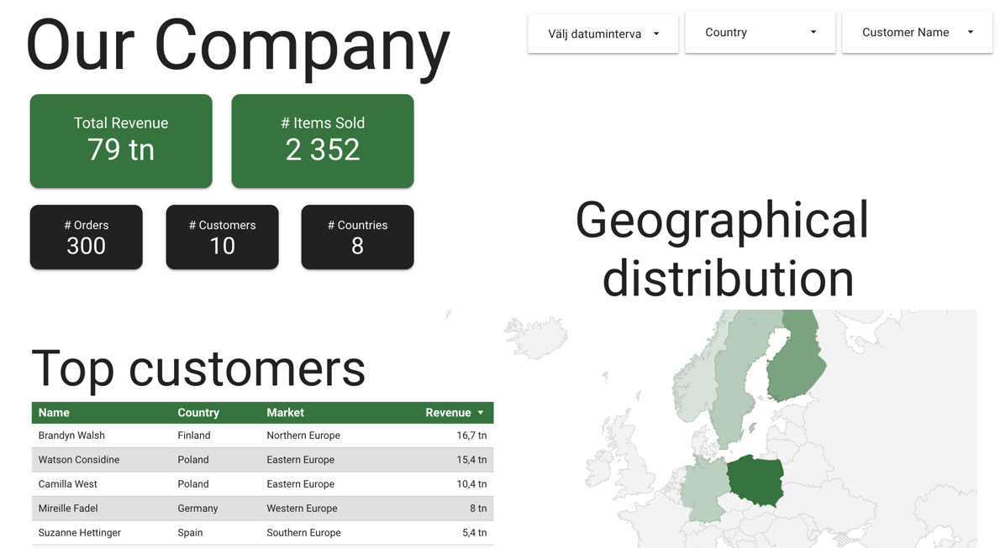
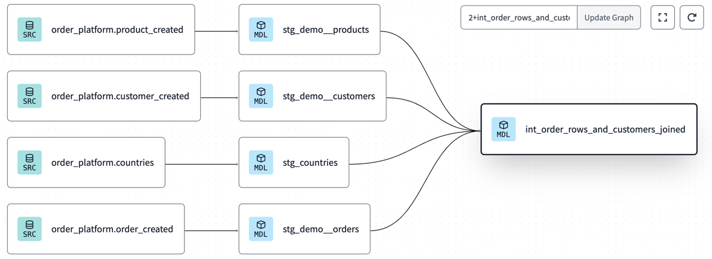

# Data platform in GCP using PubSub and DBT

A simple project to show how to connect an event based application in Google Cloud Platform
with [dbt](https://www.getdbt.com/), to create a simple, but powerful platform for data visualization. Everything (
almost 🤓) is set up using Terraform.


<div align="center" style="font-size:25px"><a style="font-size: 25px" href="https://lookerstudio.google.com/reporting/b5d6e9f8-3e3c-41c0-bd68-2046fbd8414c">Demo: Looker Studio Dashboard</a>



## Details

#### Tools:

* Google PubSub (for events)
* Google BigQuery (for data storage)
* [dbt](https://www.getdbt.com/) (for data transformation)
* Looker Studio (for data visualization)
* Terraform (for infrastructure as code)
* Go (for generating fake data)

#### Entities

* Orders
* Customers
* Products

#### Details

The flow is as follows:

1. When an entity is created (customer, product, order), an event is published to individual PubSub topics (
   customer_created, ...).
2. All events are piped and stored to BigQuery dataset
3. [dbt](https://www.getdbt.com/) uses this data set to create a basic model, and joins them
4. The output is fed back to BigQuery in a new dataset
5. Looker Studio is to create a simple dashboard with filters to analyse orders data

# DBT models

**dbt** takes its source data from BigQuery (annotated by **SRC** below) to create models (annotated by **MDL**). The
models are then fed back to BigQuery either as views or as tables.  


# How to run

You should be able to run most things yourself by cloning the repo, but you need to have a GCP account and a project set
up. DBT project is set up manually, since the free account doesn't allow API access.

## DBT setup

If you don't have a paid account, you can't use the API, so we can't use Terraform. We can still set up the project
manually.
We need the GCP service account with JobUser and DataEditor roles. Terraform will set that up, then:

1. Go to GCP console and create a new JSON key for the service accounts
2. Go to DBT and create a new project
3. Go to the project settings and add the service account key
4. Profit

## Generate fake orders

```bash
go run ./scripts/generate_orders_and_customers.go
```

------

# Magnus' notes below, you can probably stop reading here

------

## Todos

* [x] Terraform
    * [x] PubSub
    * [x] BigQuery
    * [x] GCP Service account for DBT
    * [ ] ~~DBT~~ (not supported for free accounts)
    * [x] Create modules for PubSub to BigQuery
* [x] DBT
    * [x] Add dataset for customers
    * [x] Add dataset for items (products)
    * [x] Join orders with customers and items
    * [x] Add country metadata (region, pretty name)
* [x] Looker
    * [x] Create a cooler dashboard
    * [x] Add filter for product types
* [x] Documentation
    * [x] Add intro and technical overview README
    * [x] Add final DBT model

## Resources

* https://registry.terraform.io/modules/terraform-google-modules/pubsub/google/latest
* https://medium.com/@dipan.saha/gcp-insert-records-from-pub-sub-to-bigquery-directly-2b692ff3c3e4
* https://registry.terraform.io/providers/dbt-labs/dbtcloud/latest/docs/guides/1_getting_started
* https://github.com/lukes/ISO-3166-Countries-with-Regional-Codes/blob/master/all/all.csv

## Lessons learned

* Add a DLQ to the BigQuery export directly to understand why export fails
* DBT
    * Can't use the API (and terraform) with the free version. You can probably get quite far setting up the project
      manually, or taking advantage of the trial period.
* BigQuery
    * Datasets are created in the US by default. You can't change the region after creation. I create a new dataset in
      the EU region, manually.
    * We can upload a csv to create a table in BigQuery. I manually uploaded the csv for all country codes

## Notes

How to publish a message to our topic

```
gcloud pubsub topics publish projects/$PROJECT_NAME/topics/order_created --message='{
  "order_id": "order_1",
  "customer_id": "customer_1",
  "items": [
    {
      "item_id": "item_1",
      "quantity": 1,
      "price": "9.99"
    },
    {
      "item_id": "item_2",
      "quantity": 2,
      "price": "19.99"
    }
  ],
  "order_date": "2023-01-01T12:00:00Z"
}'
```

